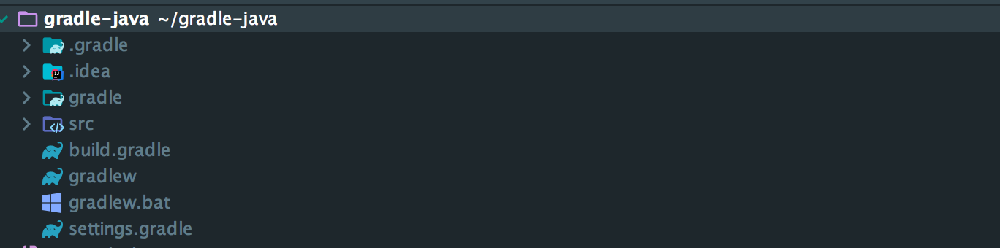
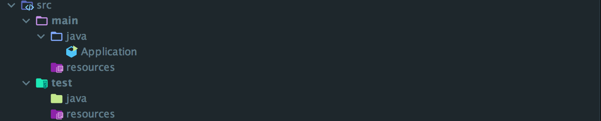
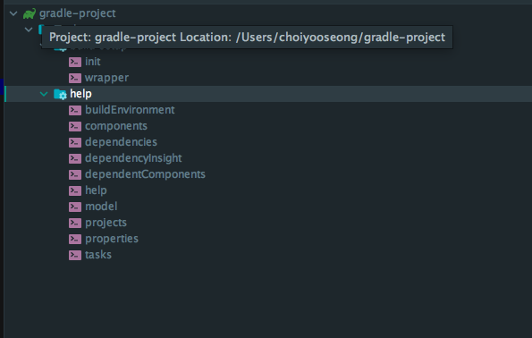
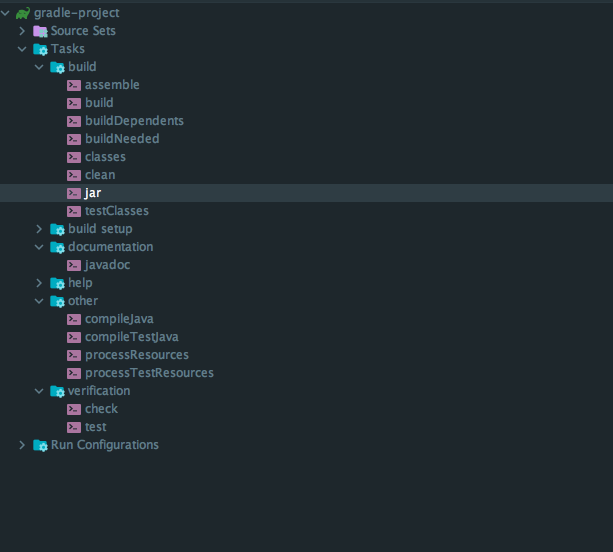
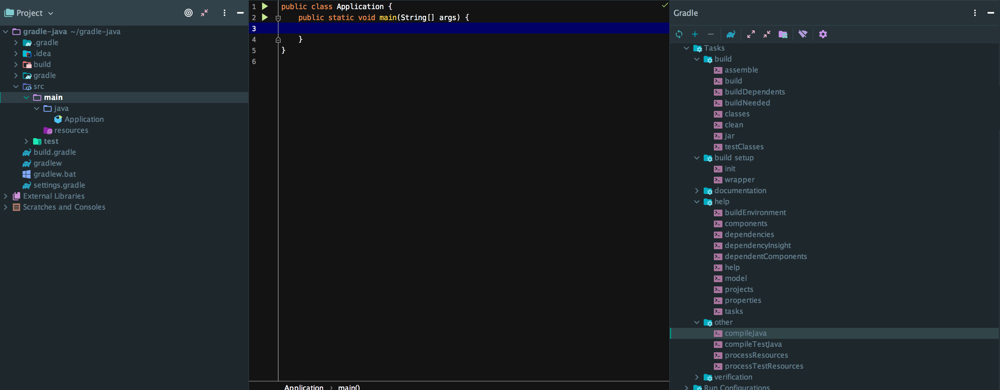
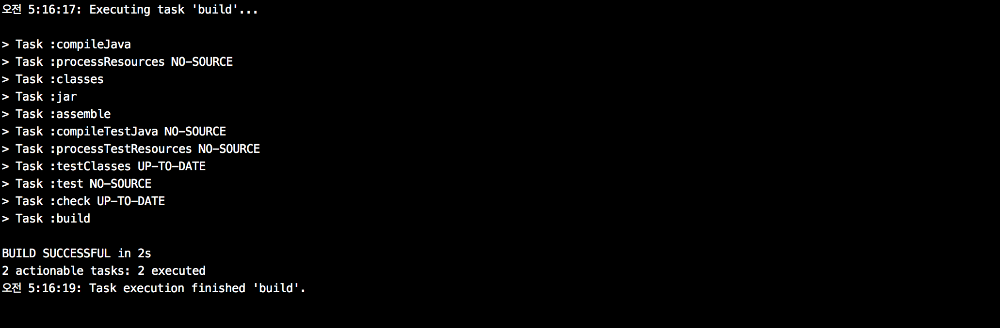
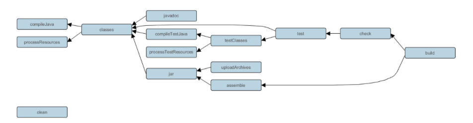
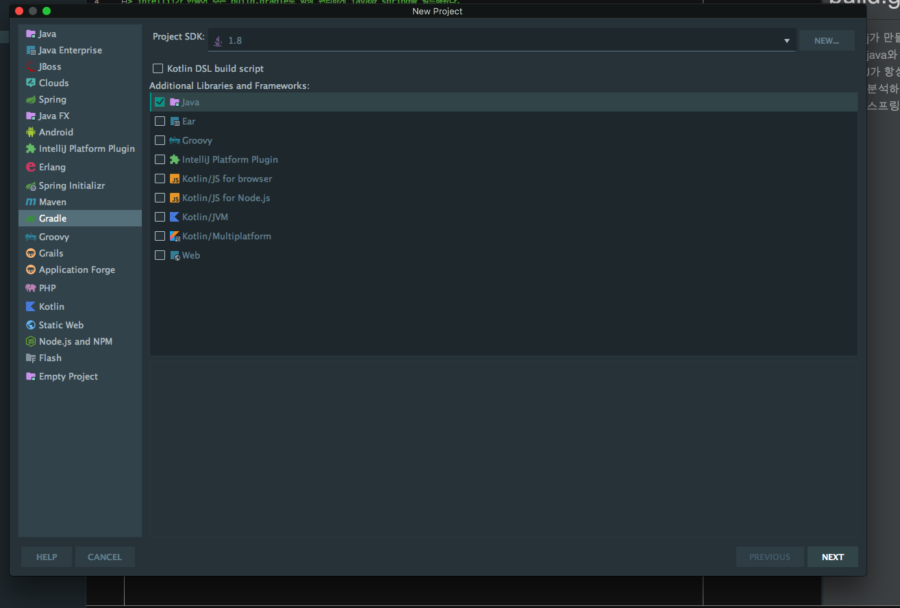
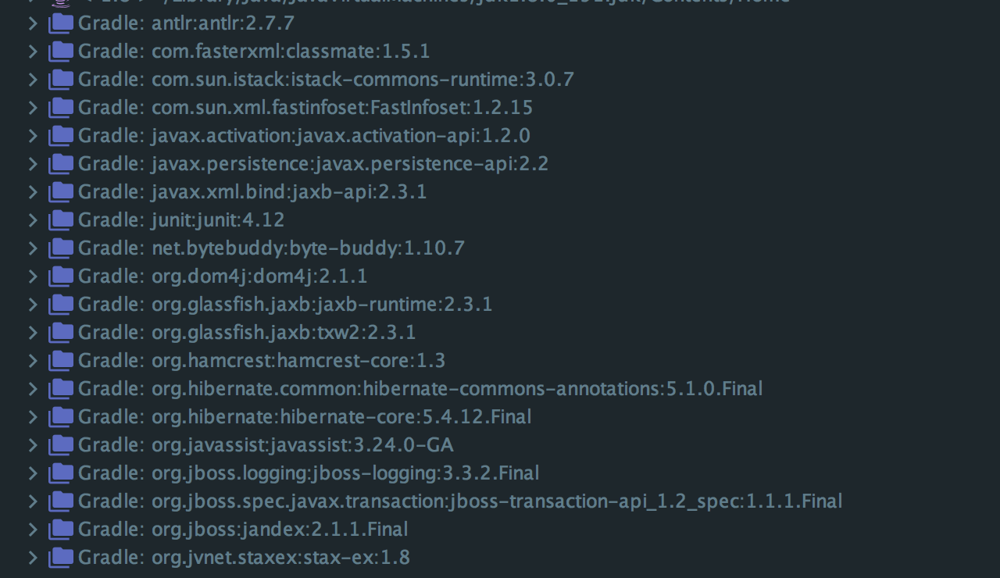

 java 프로젝트의 build gradle 파헤치
======================

>인텔리제이가 만들어 주는 build.gradle로 편리하게 java와 spring을 빌드해왔다.  
>이 글은 intellJ가 자동으로 만들어 주는 그래들 프로젝트를 분석해 본 내용이다.

인텔리제이로 그래들 자바프로젝트를 만들면 아래와 같은 패키지 구조를 가진다.

*settings.gradle*
<pre><code>
  rootProject.name = 'gradle-java'

</code></pre>

*build.gradle* 

   <pre><code>
   plugins {
       id 'java'
   }
   
   group 'org.example'
   version '1.0-SNAPSHOT'
   
   sourceCompatibility = 1.8
   
   repositories {
       mavenCentral()
   }
   
   dependencies {
       testCompile group: 'junit', name: 'junit', version: '4.12'
   }
   </code></pre>
   
settings.gradle에 루트 프로젝트의 이름이 설정되어 있다.  
build.gradle의 설정들은 이 **루트 프로젝트의 스코프**를 가지고 있는 설정들이다.

>settings.gradle에 서브 프로젝트를 추가하고,   
>build.gradle에 각각에 맞는 스코프를 만들어 의존성을 주입하면 멀티 프로젝트를 구성할 수 있다.  
>해당 프로젝트는 멀티 모듈 프로젝트가 아니므로 전체 스코프로 설정되어 있다.    

 SourceSet
 -----------
 자바 플러그인에는 **SourceSet이라는 개념**이 포함된다.   
 **그래들**을 이용해 *자바 프로젝트*를 생성하면 아래와 같이 SourceSet을 구성해준다.

 - main : 실제 작동 소스코드로 컴파일해서 JAR 파일로 만들어지는 코드이다. 
 - test : 단위 테스트 소스코드 컴파일해서 Junit으로 실행한다.

 인텔리제이에서 그래들 기반이 아닌 기본 자바프로젝트를 만들면 위의 sourceSet구성과 다르다.
  
 
 plugins
 -----------------

        플러그인은 재사용 가능한 빌드 로직을 패키지화하여 task로 제공해 빌드시 사용할 수 있도록 제공한 것이고,
        plugins블록은 사용할 플러그인을 선언하는 블록이다.
   
  위의 build.gradle 스크립트를 전부 주석처리하고 인텔리제이의 gradle에서 수행할 수 있는 task들을 확인해보자.   

   > ./gradlew build && ./gradlew tasks --all  
   > 위 명령어는 build 후 수행할 수 있는 task를 보여준다.

  

   아무 플러그인이 없는 상태에서 위 명령어를 실행하면 *help와 build setup* 종류의 테스크 밖에 없다.  
   Tasks에 있는 help는 *프로젝트에 대한 정보들을 알려주는 역할*을 한다.  
   (ex: help 중 하나인 dependencies를 수행하면 프로젝트의 디펜던시에 대한 정보가 나온다.)
 
   build setup의 task들은 그래들 프로젝트를 셋업할 수 있는 task다.   
   init을 수행시키면 build.gradle이 생성되고, wapper을 실행하면 gradlew와 gradlew.bat이 생성된다.
   
   >gradlew와 gradlew.bat은 task들을  편리하게 실행시킬 수 있도록 도와주는 실행파일이다. 
   >unix계열에서 실행할 수 있는 gradlew, window계열에서 실행할 수 있는 gradlew.bat 
   
   그렇다면 이 기본 테스크들은 build.gradle을 주석처리해도 왜 인텔리제이 gradle task에 그대로 있는것일까?     
   gradle프로젝트의 가장 기본 task들이기 때문이다.
   gradle을 설치하고 프로젝트를 init시키면 *gradle, gradle, settings.gradle*이 그래들 프로젝트의 가장 기본적인 구성요소로 생성된다.
   위와 같이 구성된 그래들 프로젝트는 *기본 gradle task*를 수행할 수 있다.
   
   > https://guides.gradle.org/building-java-libraries/
   > 그래들로 자바 프로젝트를 셋업하는 방법이다. 꼭 실습해보는 것을 추천한다. 
    
  
   
   이번에는 java플러그인을 추가하고 실행시켜 보자
   <pre><code>
    plugins {
        id 'java'
    }
   </code></pre>
   
   
   build.gradle에서 plugins만 주석을 풀고 그래들을 실행시키면 *많은 task*들이 추가된다.  
   몇가지 테스크들을 살펴보자.
 
   ##1. compileJava 
   
       Java 소스 파일을 컴파일한다.   
       인텔리제이에서 java소스에 main만 추가해서 실행시켜보자.
       
  
       
       빌드 디렉토리가 추가되고 안을 살펴보면 컴파일된 class들이 들어있다.   
   
   ##2. clean
    
        생성된 빌드 디렉토리를 삭제한다.
        
   ##3. jar
   
         main에 있는 소스를 기반으로 jar파일을 만들어 준다.
  
   ##4. build
   
        전체 프로젝트를 수행하는 종합작업이다 여러가지 테스크들이 실행된다.
     
   
   
   >더 궁금한 내용은 https://docs.gradle.org/current/userguide/java_plugin.html 참고
  
  
  아래 사진은 tasks들의 상속관계이다.  
  해당 관계를 보면 *build를 수행하면 어떤 하위 task들*이 수행되었는지 알 수 있다.
  
   
   
  > plugins블록으로 설정하는 방법과 apply로 설정하는 방법이 존재한다.   
  > 그 자세한 차이는 https://stackoverflow.com/questions/32352816/what-the-difference-in-applying-gradle-plugin을 참고!
   
   
  option
  ---------------
   
   1. group, version  
   
       *group은 생성될 아티팩트의 그룹명*이고 *version은 release*될 버전이다.   
       build를 수행하면 jar파일뒤에 해당 version이 붙어서 나온다.
   
   2. sourceCompatibility
       Java 소스를 컴파일 할 때 사용할 Java 버전이다.
       *인텔리제이에서 gradle*로 프로젝트를 만들때 선택한 *version에* 따라 설정된다.
          
  
  
  repositories
  ----------------
  
  repositories {} 블록은 이 프로젝트 *빌드에 필요한 의존성*를 다운받을 저장소이다.  
  mavenCentral, jcenter등이 있다.   
  mavenCentral은 *maven의 중앙저장소*로 gradle 내장 함수 *mavenCentral()를 이용해 중앙저장소*에 있는 의존성들을 가져올 수 있다.      
  
  >https://mvnrepository.com/ 메이븐 중앙 저장소
  
  근데 가끔보면 *maven{}으로 커스텀한 url*이 설정되어 있는 걸 볼 수 있다.  
  gradle은 중앙 저장소 뿐 아니라 maven,ivy로 구축된 *사설 저장소*에서도 의존성을 가져올 수 있도록 지원한다.  
  
  <pre><code>
 repositories {
    maven { 
       http://myrepo.com
      }
  }
  </code></pre> 
  
  *maven저장소를* 구축해서 *의존성 파일들*을 넣어놓고 위와 같이 설정한다면 myrepo에서 의존성을 가져올 수 있게 된다.  
  또 maven{} 은 여러개 설정할 수 있다.  
  이와같이 사설 의존성 저장공간을 만든다면 외부망인 maven 저장소에 접근하지 않고 안전한 내부망에서 의존성을 가져올 수 있게 된다.  
  보통 사내에서 많이 구축하여 사용한다.       
  구글에 자신만의 *maven repository 구축하는 법*들이 많이 나오니 한번 따라해봐도 좋겠다. 

  dependencies
  -----------------
  
  *dependencies{}는 프로젝트*가 작업을 수행하는데 *필요한 의존성*들을 표시한다.
  
  * 이행적 의존성 관리
        <pre><code>
        dependencies {
            compile group: 'org.hibernate', name: 'hibernate-core', version: '5.4.12.Final'
            testCompile group: 'junit', name: 'junit', version: '4.12'
        }
        </code></pre>
      
       *하이버네이트 의존성*을 추가해 보자.   
       *하이버 네이트를 추가*하면 하이버네이트가 사용하는 의존성도 같이 추가되고, 하이버네이트 의존성을 삭제하면 아래 하위 의존성들도 다같이 삭제된다.  
       이행적 의존성 관리란 내가 추가한 *의존성이 의존하고 있는 의존성*들이 같이 넘어와 관리되는 것이다.
       
   
   
   
  * 프로젝트 의존성
      
      프로젝트 의존성을 사용하면 *해당 프로젝트에서 다른 프로젝트*의 의존성을 가져올 수 있다.
      
      <pre><code>
      dependencies {
          compile project(':sub') 
      }
      </code></pre>
  
  
  
  * 파일 의존성
  
      <pre><code>
        
      dependencies {
          runtime files('libs/a.jar', 'libs/b.jar')
      }
      </code></pre>
            
      파일의존성을 *일반 jar파일*의 경로를 적어주어 의존성을 추가할 수 있다.  
      해당 방법을 사용하면 jar파일을 maver 중앙저장소나, 사설저장소에 넣지 않고도 의존성 추가가 가능하다.
  
      >이것말고도 다양한 의존성 추가방법이 있고 더 궁금한 것이 있다면 아래링크에서 확인하자.
      >https://kwonnam.pe.kr/wiki/gradle/dependencies
  
  
  * 의존성 api
      의존성 추가시 우리는 여러 api를 사용한다. (implementation,compileOnly,runtime 등)
      각각의 api은 자기만의 스코프를 가진다.
       
       * implementation - 수정 시 사용하는 모듈까지만 재빌드를 한다. 종속된 모듈의 하위 dependency를 패키지에 포함되지 않는다.   
                          만약 멀티프로젝트라면 a->b->c 상태에서 c는 a 의존성을 모른다.
                           
       * compileOnly - Gradle이 컴파일 클래스 경로에만 종속성을 추가합니다. 컴파일 클래스 경로는 build디렉토리 밑에 있는 파일이다. * 하지만 build결과에는 빠진다.
       
       * runtimeOnly - Gradle이 런타임 시에 사용하도록 빌드 출력에만 종속성을 추가합니다.  
    
  > 참고자료 https://docs.gradle.org/current/userguide/java_plugin.html 의존성 관리부분을 참고하자
 

  다음 편은 *멀티 프로젝트*에 gradle!
